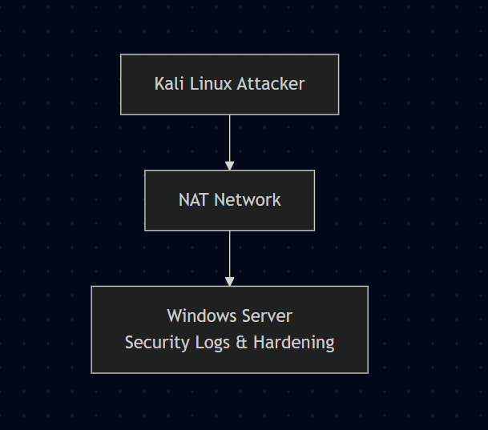
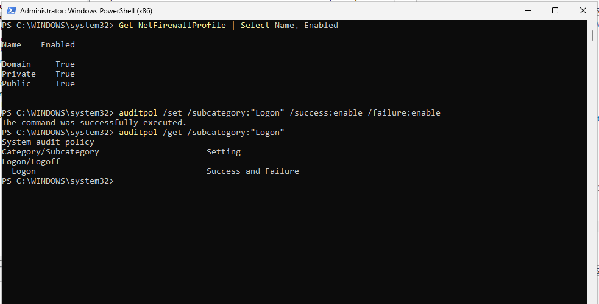
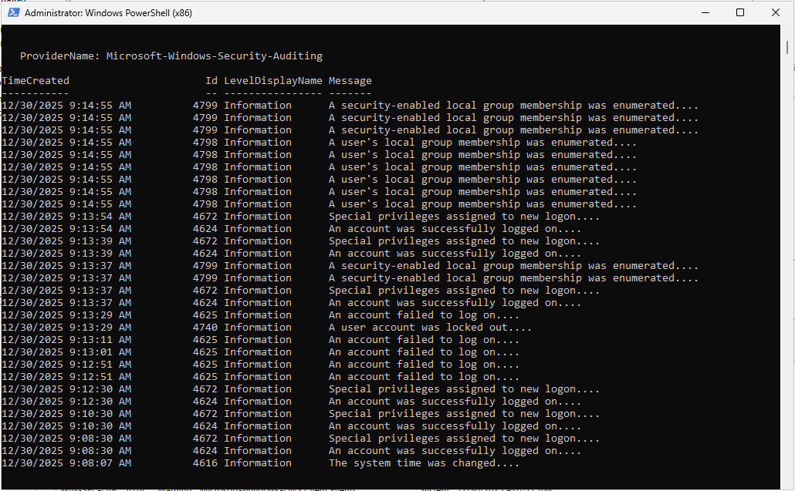
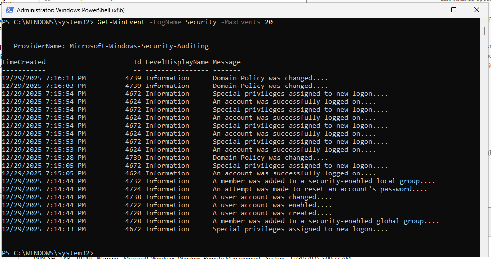

# Windows Server Security Lab

## Overview
This project demonstrates hardening a Windows Server, simulating authentication attacks from a Kali Linux machine, detecting malicious activity using Windows Security Event Logs, and mitigating attacks through built-in security controls.

The lab focuses on defensive security and incident response rather than exploitation.

---

## Lab Highlights

### Architecture

### Security Hardening

### Attack Simulation

### Detection and Mitigation

### Authorized Access Validation

---

## Environment
- Windows Server (Hardened Target)
- Kali Linux (Attacker)
- Network: NAT (VMware)

## Architecture Description
Kali Linux attempts to authenticate against a Windows Server over a NAT network.  
Security events are collected and analyzed using PowerShell.

## Key Results
- Failed authentication attempts detected (Event ID 4625)
- Account lockout enforced automatically (Event ID 4740)
- Authorized logins identified correctly (Event ID 4624)

## Tools Used
- VMware Workstation
- Windows Server (Evaluation)
- Kali Linux
- PowerShell
- evil-winrm
- nmap

## Skills Demonstrated
- Windows Server hardening
- Security auditing and logging
- Attack simulation
- Incident detection and response
- PowerShell-based log analysis

---

This project focuses on defensive security, detection, and response rather than exploitation.
